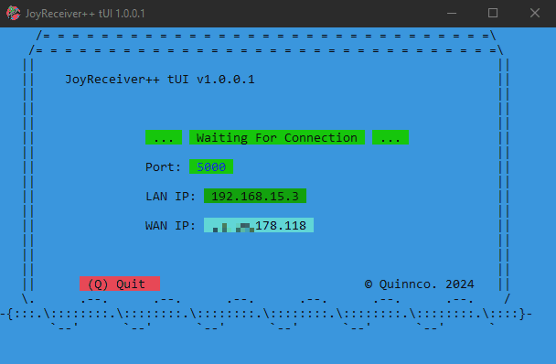

# JoyReceiver++ tUI
JoyReceiver++ tUI is a console application that receives and emulates joystick data over TCP/IP. In conjunction with JoySender++ or JoySender++ tUI, it allows you to seamlessly control a joystick connected from a remote machine on a host machine.


## Table of Contents
- [Requirements](#requirements)
- [Usage](#usage)
- [With Command-Line Parameters](#with-command-line-parameters)
- [Examples](#examples)
- [Contact](#contact)

## Requirements

Before using JoyReceiver++ tUI, make sure you have installed the ViGEm Bus Driver:

- ViGEm Bus Driver: JoyReceiver++ tUI requires the ViGEm Bus driver to enable joystick emulation. Ensure you have the ViGEm Bus driver installed on your system before using JoyReceiver++ tUI. You can download and install the ViGEm Bus driver from the official ViGEm GitHub repository or website.
        [ViGEmBus Driver](https://github.com/ViGEm/ViGEmBus)

## Usage

To use JoyReceiver++ tUI:
- Simply run the JoyReceiver++ tUI executable.
- JoyReceiver++ will start listening for incoming joystick data on the default port (5000). As well as provide you with a LAN and WAN ip address for your machine to make it easy to set up the connection. \

- Once a connection is received, gamepad emulation will begin using the ViGEm driver. \


### With Command-Line Parameters
JoyReceiver++ tUI provides command-line parameters for advanced settings and customization. Here are the available options:

    -p, --port <PORT>: Sets the port number to run JoyReceiver++ tUI on for communication with the client/sender.
    -h, --help: Displays the help message with information on how to use JoyReceiver++ tUI and its available options.

By default, JoyReceiver++ tUI uses port 5000 for communication. If you wish to use a different port, specify it using the -p/--port option.

```
JoyReceiver++ [OPTIONS]
```

## Examples
**Example Usage:**

To run JoyReceiver++ tUI with default settings, simply execute the following command:

```
'JoyReceiver++ tUI'
```

To specify the port to listen on, use the `-p/--port`option:

```
'JoyReceiver++ tUI' -p 8080
```

**Note:** You can safely quit the program at any time by pressing `Ctrl + C` in the console window.


## License
MIT Licence

Copyright (c) 2024 Dave Quinn <qcent@yahoo.com>

Permission is hereby granted, free of charge, to any person obtaining a copy
of this software and associated documentation files (the "Software"), to deal
in the Software without restriction, including without limitation the rights
to use, copy, modify, merge, publish, distribute, sublicense, and/or sell
copies of the Software, and to permit persons to whom the Software is
furnished to do so, subject to the following conditions:

The above copyright notice and this permission notice shall be included in
all copies or substantial portions of the Software.

THE SOFTWARE IS PROVIDED "AS IS", WITHOUT WARRANTY OF ANY KIND, EXPRESS OR
IMPLIED, INCLUDING BUT NOT LIMITED TO THE WARRANTIES OF MERCHANTABILITY,
FITNESS FOR A PARTICULAR PURPOSE AND NONINFRINGEMENT. IN NO EVENT SHALL THE
AUTHORS OR COPYRIGHT HOLDERS BE LIABLE FOR ANY CLAIM, DAMAGES OR OTHER
LIABILITY, WHETHER IN AN ACTION OF CONTRACT, TORT OR OTHERWISE, ARISING FROM,
OUT OF OR IN CONNECTION WITH THE SOFTWARE OR THE USE OR OTHER DEALINGS IN
THE SOFTWARE.


## Contact
If you are interested in contributing or just want to chat email me at qcent@yahoo.com
