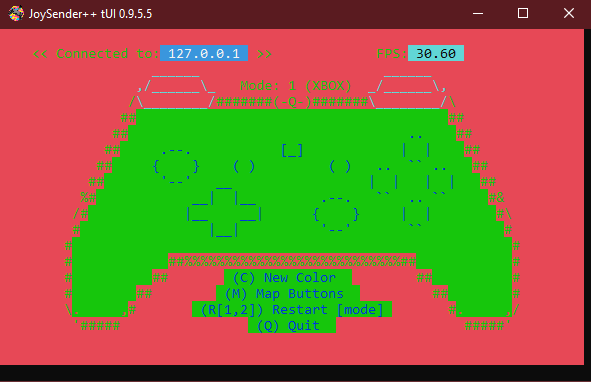
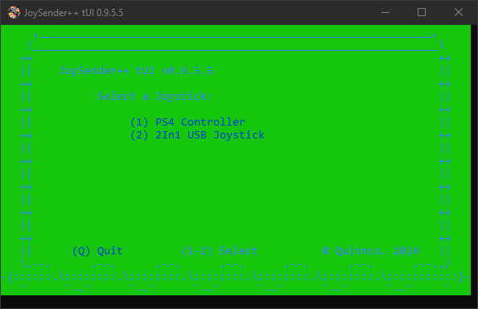
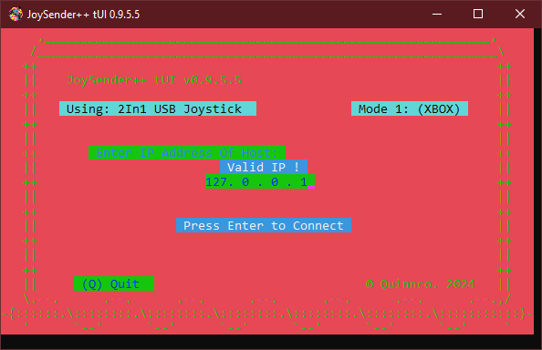
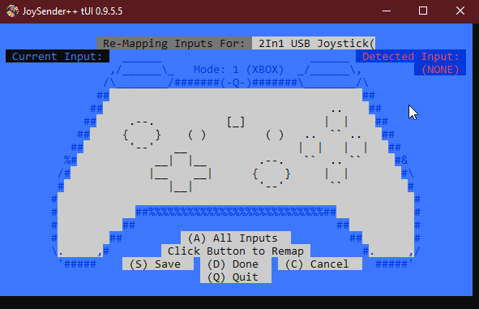

# JoySender 3 tUI
JoySender is a console application that enables you to send joystick data over UDP or TCP, to a host/server. It simplifies the process of remote joystick control, allowing you to enjoy gaming experiences on a different machine within a local network or even over the internet. \
It runs in two modes: 

**Mode 1:** 
- JoySender tUI uses user created button mapping to emulate an Xbox360 controller on host machine running JoyReceiver or JoyReceiver tUI. 

**Mode 2:** 
- JoySender tUI reads input reports from a DS4 controller and sends them to a host machine running JoyReceiver or JoyReceiver tUI. This mode will send all data associated with DS4 device i.e. gyro, accelerometer, touchpad, battery, etc.
- Beta Support for Switch compatible Pro Controllers, emulated as DS4 with gyro/accel capabilities. 



## Table of Contents
- [Usage](#usage)
- [With Command-Line Parameters](#with-command-line-parameters)
- [Examples](#examples)
- [Mapping Joystick Inputs to an Xbox360 Controller](#mapping-joystick-inputs-to-an-xbox360-controller)
- [HotKeys](#hotkeys)
- [Contact](#contact)

## Usage


To use JoySender tUI, follow these steps:
- Run the JoySender tUI executable without any parameters.
- JoySender tUI will guide you through the initial joystick mapping process. Follow the on-screen instructions to assign buttons and axes to your joystick.
Once mapped, JoySender tUI will ask for a host address to start transmitting joystick data.
- JoySender tUI remembers the last 5 unique IP addresses you have entered. Press the up arrow to cycle through saved addresses.



### With Command-Line Parameters

```
JoySender_tUI [OPTIONS] <ipaddress of host>
```

**Options:**

- `-n, --host <IP>`: Specifies the IP address of the host/server. Provide the IP address where you want to send the joystick data. This flag can be omitted.

- `-p, --port <PORT>`: Sets the port number to run JoySender tUI on. Specify the port number for communication with the host/server. The default port is set to `5000`.

- `-f, --fps <FPS>`: Defines the communication frequency with the server in attempts per second. Set the desired frequency for communicating with the server. The default is `30` attempts per second.

- `-m, --mode <MODE>`: Sets the operational mode for JoySender tUI. Use `1` for Xbox 360 emulation mode or `2` for DS4 emulation mode. Choose the desired mode based on your requirements. The default mode is Xbox 360 emulation.

- `-t, --tcp`: Use TCP protocol.

- `-u, --udp`: Use UDP protocol. (default)

- `-a, --auto`: Automatically selects the first joystick recognized by the system. If you have multiple joysticks connected, this option will automatically choose the first one. By default, this option is disabled.

- `-h, --help`: Displays the help message with information on how to use JoySender tUI and its available options.


## Examples
**Example Usage:**

To run JoySender tUI with default settings, simply execute the following command, you will be prompted to enter a host address:

```
'JoySender_tUI'
```

To specify the IP address and port of the host/server, type the ip and use the `-p/--port` option:

```
'JoySender_tUI' 192.168.1.100 -p 8080
```

For DS4 emulation mode, running at 45 fps, use the following command:

```
'JoySender_tUI' -m 2 -f 45
```

For DS4 emulation mode, running at 88 fps, and transmitting over TCP, use the following command:

```
'JoySender_tUI' -m 2 -f 88 -t
```


## Mapping Joystick Inputs to an Xbox360 Controller


While using JoySender tUI in Mode 1: 
- Upon selecting an unmapped joystick or initiating a re-mapping process, you will be prompted to set inputs corresponding to Xbox360 controller inputs. 
This allows you to map the various buttons and controls on your joystick to the equivalent Xbox360 controller inputs.

- It is important to note that excessively noisy or glitchy analog sticks on your joystick can potentially cause issues during the mapping process.

- Pressing `Esc` will skip the current input. Allowing you to not set a mapping for an input.

- Once you have successfully mapped all the desired inputs for your joystick, JoySender tUI will be able to emulate your joystick inputs as an Xbox360 controller on a machine running JoyReceiver or JoyReceiver tUI. 

- To remap your selected joystick inputs, simply press Shift+M within the JoySender tUI application. This will initiate the remapping process and allow you to modify or update the mapping configuration.

- Mappings are saved to disc, for reuse when controller is selected in the future.

## HotKeys
Once you establish a connection with the host/server, JoySender provides several hotkey buttons for convenient control:

- `Shift + C`: Pressing Shift and C together will generate a new random color scheme for the on-screen controller and the user interface.

- `Shift + M`: Pressing Shift and M together will initiate the joystick remapping process. This allows you to reconfigure the joystick mapping on the fly.

- `Shift + R`: Pressing Shift and R together will restart the JoySender tUI program, resetting the connection and settings.
 Additionally, while holding the R key, pressing 1 or 2 will allow you to switch between different modes while in a connection. This is useful for changing the operational mode on the fly.

- `Shift + Q`: Pressing Shift and Q together will quit the JoySender program.


## License
MIT Licence

Copyright (c) 2025 Dave Quinn <qcent@yahoo.com>

Permission is hereby granted, free of charge, to any person obtaining a copy
of this software and associated documentation files (the "Software"), to deal
in the Software without restriction, including without limitation the rights
to use, copy, modify, merge, publish, distribute, sublicense, and/or sell
copies of the Software, and to permit persons to whom the Software is
furnished to do so, subject to the following conditions:

The above copyright notice and this permission notice shall be included in
all copies or substantial portions of the Software.

THE SOFTWARE IS PROVIDED "AS IS", WITHOUT WARRANTY OF ANY KIND, EXPRESS OR
IMPLIED, INCLUDING BUT NOT LIMITED TO THE WARRANTIES OF MERCHANTABILITY,
FITNESS FOR A PARTICULAR PURPOSE AND NONINFRINGEMENT. IN NO EVENT SHALL THE
AUTHORS OR COPYRIGHT HOLDERS BE LIABLE FOR ANY CLAIM, DAMAGES OR OTHER
LIABILITY, WHETHER IN AN ACTION OF CONTRACT, TORT OR OTHERWISE, ARISING FROM,
OUT OF OR IN CONNECTION WITH THE SOFTWARE OR THE USE OR OTHER DEALINGS IN
THE SOFTWARE.


## Contact
If you are interested in contributing or just want to chat email me at qcent@yahoo.com
