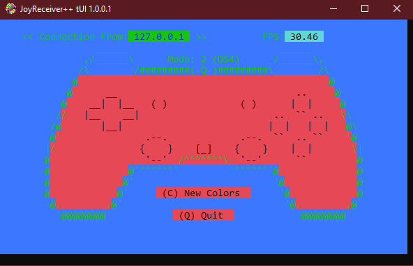

# Project NetJoy tUI

## Streamlined Remote Joystick Control

Project NetJoy tUI is a software solution that allows for seamless remote control of joysticks between Windows machines. It enables users to send joystick inputs over a network, facilitating remote gaming, simulations, and various applications. With NetJoy, you can emulate any joystick as an Xbox 360 controller, pass through DualShock 4 inputs (including gyro motion), customize control mappings, and experience rumble feedback for enhanced immersion.

NetJoy tUI (textual User Interface) is NetJoy with a colorful console interface that supports mouse clicks, features in console buttons, and provides realtime feedback on joystick inputs. All powered by ASCII characters and ANSI magic.  

## Table of Contents
- [Key Features](#key-features)
- [Requirements](#requirements)
- [Installation](#installation)
- [Usage](#usage)
- [License](#license)
- [Contact](#contact)

## Key Features
#### JoySender++ tUI: Xbox 360 Emulation and DS4 Passthrough
- JoySender++ tUI offers two modes of operation. In Xbox 360 emulation mode (mode 1), connect any Windows-recognized joystick and emulate it as an Xbox 360 controller on the host machine.
DS4 passthrough mode (mode 2). When a DualShock 4 (DS4) controller is connected, you can emulate a DS4 controller on the host machine. DS4 passthrough mode allows DS4 controller users to fully utilize their controller's capabilities, providing gyro/acceleration and touchpad data to the remote machine.
#### JoyReceiver++ tUI: Seamless Input Emulation via ViGEm Driver
- JoyReceiver++ tUI works in conjunction with JoySender++ on a host machine. It receives the selected mode and joystick inputs transmitted by JoySender++. Based on the mode and input received, JoyReceiver++ emulates the corresponding input on the host machine using the ViGEm driver. This integration ensures seamless and accurate input emulation, enabling smooth gameplay and application interaction.

#### Customizable Control Mapping
  Project NetJoy offers flexibility in control mapping. You can map any joystick input to any Xbox 360 input, allowing you to create personalized control schemes that suit your preferences and playstyle. Whether you require specific layouts or remapped inputs for optimal gameplay, Project NetJoy provides the versatility to accommodate your needs.
#### Rumble Feedback
- To enhance the gaming experience, Project NetJoy supports rumble feedback for both Xbox 360 and DS4 modes. This feature provides tactile feedback to the user, simulating vibration effects through the connected controllers. Rumble feedback adds an extra layer of immersion, making games more engaging and interactive.

## Requirements

Before installing and using Project NetJoy tUI, make sure you meet the following requirements:

- Operating System: Compatible with Windows operating systems only.

- ViGEm Bus Driver: JoyReceiver++ tUI requires the ViGEm Bus driver to enable joystick emulation. Ensure you have the ViGEm Bus driver installed on your system before using JoyReceiver++ tUI. You can download and install the ViGEm Bus driver from the official ViGEm GitHub repository or website.
        [ViGEmBus Driver](https://github.com/ViGEm/ViGEmBus)

- SDL.dll: JoySender++ tUI requires the SDL.dll library file to function properly. This library is provided and should be placed in the same folder as the JoySender++ executable. 

- Visual Studio 2022+ Community Edition: To easily build the Project NetJoy applications. [Visual Studio](https://visualstudio.microsoft.com/vs/community/)
 
## Installation
To get right at it download the win32 binaries:
[SourceForge](https://sourceforge.net/projects/netjoy/files/NetJoy.7z/download)

To get started with customizing Project NetJoy tUI, follow these steps:

- Download the Repository: Begin by downloading the project repository to your local machine. You can do this by clicking on the "Download" button or by cloning the repository using Git.
 Project NetJoy is built using Visual Studio 2022 Community Edition.  Download Link: [Visual Studio 2022 Community Edition](https://visualstudio.microsoft.com/vs/community/)
- JoySender++ tUI and JoyReceiver++ tUI: NetJoy tUI is comprised of two sister applications: JoySender++ tUI and JoyReceiver++ tUI. Each application has its own separate folder and solution file.
- Open the Solution Files: Navigate to the JoySender++ / JoyReceiver++ folders and open the corresponding solution file (.sln) in Visual Studio.
- Change the code / rewrite the code.
- Build the Projects : In Visual Studio, build the solution by selecting the appropriate build configuration (JoyReciever++ is Release Only) and clicking on the build button. This will compile the project and generate the necessary executable files.
    
## Usage
Both JoySender++ tUI and JoyReceiver++ tUI are console applications that can be run without any command-line parameters in most situations. They provide a straightforward and intuitive way to enable remote joystick control and enhance gaming experiences. However, for advanced settings and customization, command-line parameters are available.

To get started, follow these steps:
- JoySender++ tUI: JoySender++ tUI allows you to send joystick data over TCP/IP to a host/server. It can be executed without any command-line parameters to use the default settings. Simply run the JoySender++ tUI executable, and it will guide you through the initial joystick mapping process. Once mapped, JoySender++ tUI will start transmitting joystick data to the specified host/server.
        For advanced settings and customization, you can utilize command-line parameters. Refer to the JoySender++ tUI [README](https://github.com/Qcent/NetJoy/blob/tUI/JoySender++/README.md) file for detailed instructions on how to use the available options.
- JoyReceiver++ tUI: JoyReceiver++ tUI operates on the host/server machine and receives the joystick data transmitted by JoySender++. Like JoySender++, it can also be run without any command-line parameters for basic functionality. Run the JoyReceiver++ executable, and it will start emulating the received joystick input using the ViGEm driver.
        If you wish to explore advanced settings and additional features, consult the JoyReceiver++ tUI [README](https://github.com/Qcent/NetJoy/blob/tUI/JoyReceiver++/README.md) file for instructions on utilizing command-line parameters.

    Refer to the [JoySender++ tUI README](https://github.com/Qcent/NetJoy/blob/tUI/JoySender++/README.md) file for detailed instructions. \
    Refer to the [JoyReceiver++ tUI README](https://github.com/Qcent/NetJoy/blob/tUI/JoyReceiver++/README.md) file for detailed instructions.

## License
MIT Licence

Copyright (c) 2024 Dave Quinn <qcent@yahoo.com>

Permission is hereby granted, free of charge, to any person obtaining a copy
of this software and associated documentation files (the "Software"), to deal
in the Software without restriction, including without limitation the rights
to use, copy, modify, merge, publish, distribute, sublicense, and/or sell
copies of the Software, and to permit persons to whom the Software is
furnished to do so, subject to the following conditions:

The above copyright notice and this permission notice shall be included in
all copies or substantial portions of the Software.

THE SOFTWARE IS PROVIDED "AS IS", WITHOUT WARRANTY OF ANY KIND, EXPRESS OR
IMPLIED, INCLUDING BUT NOT LIMITED TO THE WARRANTIES OF MERCHANTABILITY,
FITNESS FOR A PARTICULAR PURPOSE AND NONINFRINGEMENT. IN NO EVENT SHALL THE
AUTHORS OR COPYRIGHT HOLDERS BE LIABLE FOR ANY CLAIM, DAMAGES OR OTHER
LIABILITY, WHETHER IN AN ACTION OF CONTRACT, TORT OR OTHERWISE, ARISING FROM,
OUT OF OR IN CONNECTION WITH THE SOFTWARE OR THE USE OR OTHER DEALINGS IN
THE SOFTWARE.

## Contact
If you are interested in contributing or just want to chat email me at qcent@yahoo.com
