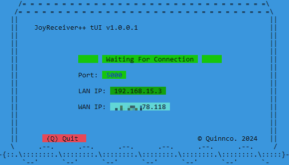

# Project NetJoy
Project NetJoy is a software solution that allows for remote joystick control between Windows machines. It enables users to send joystick inputs over a network, facilitating remote gaming, simulations, and various applications. With NetJoy, you can emulate any joystick as an Xbox 360 controller, pass through DualShock 4 inputs (including gyro motion), customize control mappings, and experience rumble feedback for enhanced immersion.

Available in two (2) flavours, [bland(++)](#plain-console) and [colorful(tUI)](#colorful-tUI), both are cross compatible.
For non Windows OS users there is a compatible python script (sender only for non windows) [JoySendPy](https://github.com/Qcent/JoySendPy).

### Version 2.0
NetJoy has reached version 2.0.
#### Featuring:
- a new and improved input mapping system
- improved functionality
- dozens of bugfixes
- and better UI.

## Table of Contents
- [Key Features](#key-features)
- [Requirements](#requirements)
- [Installation](#installation)
- [Usage](#usage)
- [Screenshots](#screenshots)
- [License](#license)
- [Contact](#contact)

## Key Features
#### JoySender: Xbox 360 Controller Emulation
- Connect any Windows recognized joystick and seamlessly emulate it as an Xbox 360 controller on the host machine. This mode features user created button mapping to emulate controller input on the host machine.
#### JoySender: DS4 Controller Emulation
- When a DualShock 4 (DS4) controller is connected, select mode 2 to  emulate a DS4 controller on the host machine. This mode allows DS4 controller users to fully utilize their controller's capabilities on the remote machine, providing all gyro, accelerometer and controller metadata to the host machine.
#### JoyReceiver: Seamless Input Emulation via ViGEm Driver
- JoyReceiver works in conjunction with JoySender on the host machine. It receives the selected mode and joystick inputs transmitted by JoySender. Based on the mode and input received, JoyReceiver emulates the corresponding input on the host machine using the [ViGEmBus Driver](https://github.com/ViGEm/ViGEmBus).
#### Customizable Control Mapping
- Project NetJoy offers flexibility in control mapping. You can map any joystick input to any Xbox 360 input, allowing you to create personalized control schemes that suit your preferences and play style. Whether you require specific layouts or remapped inputs for optimal gameplay, Project NetJoy provides the versatility to accommodate your needs.
#### Rumble Feedback
- To enhance the gaming experience, Project NetJoy supports rumble feedback for both Xbox 360 and DS4 modes. This feature provides tactile feedback to the user, simulating vibration effects through the connected controllers.

## Requirements

Before installing and using Project NetJoy, make sure you meet the following requirements:

- Operating System: Project NetJoy is compatible with Windows operating systems. It requires the [MSVC Redistributable](https://learn.microsoft.com/en-us/cpp/windows/latest-supported-vc-redist?view=msvc-170#visual-studio-2015-2017-2019-and-2022) for the machine architecture (x86/x64).

- ViGEm Bus Driver: JoyReceiver requires the ViGEm Bus driver to enable joystick emulation. Ensure you have the ViGEm Bus driver installed on your system before using JoyReceiver. You can download and install the ViGEm Bus driver from the official ViGEm GitHub repository or website.
        [ViGEmBus Driver](https://github.com/ViGEm/ViGEmBus)

- SDL3.dll: JoySender requires the SDL3.dll library file for gamepad / joystick handling. The [SDL3](https://wiki.libsdl.org/SDL3/FrontPage).dll is provided and should be placed in the same folder as the JoySender executable. 

- Visual Studio 2022+ Community Edition: To easily build the Project NetJoy applications. [Visual Studio](https://visualstudio.microsoft.com/vs/community/)
 
## Installation
To get right at it download the win32/x64 binaries:
[SourceForge](https://sourceforge.net/projects/netjoy/files/)

To get started with customizing Project NetJoy, follow these steps:

- Download the Repository: Begin by downloading the project repository to your local machine. You can do this by clicking on the "Download" button or by cloning the repository using Git.
 Project NetJoy is built using Visual Studio 2022 Community Edition.  Download Link: [Visual Studio 2022 Community Edition](https://visualstudio.microsoft.com/vs/community/)
- NetJoy comprises two twin-sister applications: (JoySender++/JoySender_tUI) and (JoyReceiver++/JoyReceiver_tUI). Each application has its own separate folder. Solution files are in the ++ directories and contain both ++ and tUI projects.
- Open the Solution Files: Navigate to the JoySender++ / JoyReceiver++ folders and open the corresponding solution file (.sln) in Visual Studio.
- Change the code / rewrite the code.
- Build the Projects : In Visual Studio, build the solution by selecting the appropriate build configuration (JoyReceiver is Release Only) and clicking on the build button. This will compile the project and generate the necessary executable files.
    
## Usage
Both JoySender and JoyReceiver are console applications that can be run without any command-line parameters in most situations. They provide a straightforward and intuitive way to enable remote joystick control and enhance gaming experiences. However, for advanced settings and customization, command-line parameters are available.

To get started, follow these steps:
### JoySender
- Allows you to send joystick data over TCP/IP to a host/server.
- Run any JoySender executable, and it will guide you through the initial joystick mapping process. 
- Once mapped, JoySender will request an ip to the host/server, and start transmitting joystick data.
 
### JoyReceiver
- Operates on the host/server machine and receives the joystick data transmitted by JoySender. 
- Run the JoyReceiver executable, and it will open port 5000 and await a connection from JoySender
- Once a connection has been established JoyReceiver will begin emulating the received joystick input using the ViGEm driver.

\
  For advanced settings and customization, you can utilize command-line parameters.\
    Refer to the [JoySender++ README](https://github.com/Qcent/NetJoy/blob/main/JoySender++/README.md) file for detailed instructions. \
    Refer to the [JoyReceiver++ README](https://github.com/Qcent/NetJoy/blob/main/JoyReceiver++/README.md) file for detailed instructions. \
    Refer to the [JoySender_tUI README](https://github.com/Qcent/NetJoy/blob/main/JoySender_tUI/README.md) file for detailed instructions. \
    Refer to the [JoyReceiver_tUI README](https://github.com/Qcent/NetJoy/blob/main/JoyReceiver_tUI/README.md) file for detailed instructions.

## Screenshots
### plain console

### Colorful (tUI)

## License
MIT Licence

Copyright (c) 2024 Dave Quinn <qcent@yahoo.com>

Permission is hereby granted, free of charge, to any person obtaining a copy
of this software and associated documentation files (the "Software"), to deal
in the Software without restriction, including without limitation the rights
to use, copy, modify, merge, publish, distribute, sublicense, and/or sell
copies of the Software, and to permit persons to whom the Software is
furnished to do so, subject to the following conditions:

The above copyright notice and this permission notice shall be included in
all copies or substantial portions of the Software.

THE SOFTWARE IS PROVIDED "AS IS", WITHOUT WARRANTY OF ANY KIND, EXPRESS OR
IMPLIED, INCLUDING BUT NOT LIMITED TO THE WARRANTIES OF MERCHANTABILITY,
FITNESS FOR A PARTICULAR PURPOSE AND NONINFRINGEMENT. IN NO EVENT SHALL THE
AUTHORS OR COPYRIGHT HOLDERS BE LIABLE FOR ANY CLAIM, DAMAGES OR OTHER
LIABILITY, WHETHER IN AN ACTION OF CONTRACT, TORT OR OTHERWISE, ARISING FROM,
OUT OF OR IN CONNECTION WITH THE SOFTWARE OR THE USE OR OTHER DEALINGS IN
THE SOFTWARE.

## Contact
If you are interested in contributing or just want to chat email me at qcent@yahoo.com
